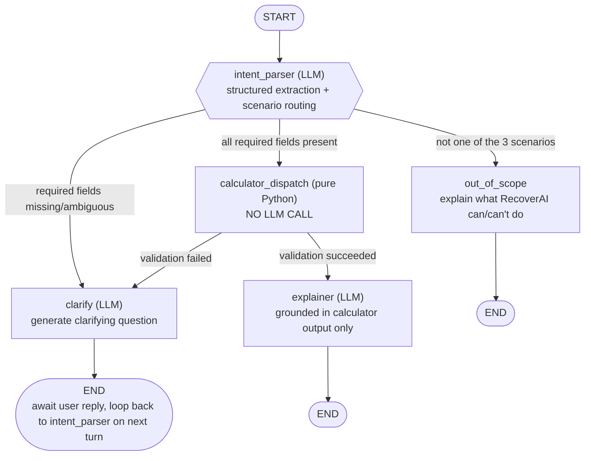

# RecoverAI

A personal-finance "what would happen if" simulator. Describe a financial decision in
plain language and RecoverAI extracts the parameters, runs deterministic calculators,
and explains the trade-offs side by side.

**Core design principle:** the LLM never does arithmetic. It only (1) extracts structured
parameters from your message, (2) decides which calculator applies, (3) asks a clarifying
question if something's missing, and (4) explains the calculator's output in plain
language. All numbers come from `backend/app/calculators.py`, a pure-Python module with
zero LLM/API calls — verify this yourself with:

```bash
grep -iE "openai|anthropic|langchain|requests|httpx" backend/app/calculators.py
# (no output = confirmed clean)
```

## Architecture

Orchestration is a real LangGraph `StateGraph` with conditional edges — not a linear
function chain or a pile of if-statements.



Because `/api/chat` is a stateless request/response endpoint, the `clarify -> intent_parser`
loop happens *across* HTTP calls: each session's message history is kept server-side
(in-memory dict keyed by `session_id`), and every new user message re-invokes the graph
from `intent_parser` with the full accumulated conversation.

### Nodes

| Node | LLM call? | Responsibility |
|---|---|---|
| `intent_parser` | Yes (structured/JSON-mode) | Picks which of the 3 calculator scenarios applies, extracts parameters, flags missing fields |
| `clarify` | Yes | Writes one natural-language question asking for exactly what's missing |
| `calculator_dispatch` | **No** | Pure Python — validates inputs, calls the matching calculator function |
| `explainer` | Yes | Turns calculator output into a plain-language summary; system prompt forbids inventing numbers |
| `out_of_scope` | No | Returns a fixed explanation of what RecoverAI can and can't do |

## Project layout

```
recoverai/
  backend/
    app/
      calculators.py   # pure, deterministic, unit-testable math (no LLM)
      graph.py          # LangGraph StateGraph + nodes + conditional edges
      schemas.py        # Pydantic models: API I/O + structured LLM output
      main.py            # FastAPI app, in-memory session store, /api/chat, /api/health
    tests/
      test_calculators.py
    requirements.txt
    Dockerfile
    render.yaml
    .env.example
  frontend/
    src/
      App.tsx
      api.ts
      types.ts
      components/
        Chat.tsx
        ResultView.tsx
    vercel.json
    .env.example
```

## Setup — backend

```bash
cd backend
python -m venv .venv
./.venv/Scripts/activate   # Windows; use `source .venv/bin/activate` on macOS/Linux
pip install -r requirements.txt
cp .env.example .env       # then fill in OPENAI_API_KEY
uvicorn app.main:app --reload --port 8000
```

Run the calculator unit tests (no API key needed — this module has no LLM calls):

```bash
pytest tests/ -q
```

## Setup — frontend

```bash
cd frontend
npm install
cp .env.example .env   # set VITE_API_BASE_URL if backend isn't on localhost:8000
npm run dev
```

Open `http://localhost:5173`.

## API contract

`POST /api/chat`

```json
// request
{ "session_id": "uuid-string", "message": "user's natural language input" }
```

```json
// response
{
  "session_id": "uuid-string",
  "type": "clarifying_question" | "result" | "error",
  "message": "agent's text response (question or lead-in to result)",
  "result": {
    "scenario": "sip_pause_vs_loan_payoff",
    "calculator_output": { "...": "raw numbers" },
    "explanation": "plain language text",
    "assumptions": ["...", "..."]
  }
}
```

If `type` is `"clarifying_question"`, `result` is `null` — POST again with the same
`session_id` and the user's answer to continue the conversation.

`GET /api/health` — returns `{"status": "ok"}`.

## Deployment

- **Frontend (Vercel):** `frontend/vercel.json` handles SPA routing. Set
  `VITE_API_BASE_URL` to your deployed backend URL in Vercel's project env vars.
- **Backend (Render or Railway):** `backend/Dockerfile` builds the FastAPI app;
  `backend/render.yaml` is a ready-to-use Render blueprint. Set `OPENAI_API_KEY` and
  `CORS_ORIGINS` (your Vercel domain) as env vars on whichever platform you use.

## Example walkthroughs

### 4a. SIP-Pause-vs-Loan-Payoff

**Input:** "What if I pause my ₹5,000/month SIP (expecting 10% annual return) for 6
months to put extra money toward my ₹5,00,000 personal loan at 10% interest, which has
36 months left?"

**Extracted params:**
```json
{
  "scenario": "sip_pause_vs_loan_payoff",
  "monthly_sip_amount": 5000,
  "expected_annual_return_pct": 10,
  "loan_outstanding_amount": 500000,
  "loan_interest_rate_pct": 10,
  "loan_remaining_tenure_months": 36,
  "pause_duration_months": 6
}
```

**Calculator output (abridged):**
```json
{
  "scenario_a": { "label": "Continue SIP", "loan_total_interest": 80809.37, "loan_months_taken": 36, "sip_final_corpus": 210650.01 },
  "scenario_b": { "label": "Pause & Pay Off Loan", "loan_total_interest": 71765.70, "loan_months_taken": 34, "sip_final_corpus": 171031.06 },
  "comparison": { "loan_interest_saved": 9043.67, "loan_tenure_reduced_months": 2, "sip_corpus_difference": -39618.95, "net_financial_difference": -30575.28 }
}
```

Here pausing the SIP saves ~₹9,000 in loan interest and shaves 2 months off the tenure,
but costs ~₹39,600 in foregone SIP growth — a net negative in this case, which is exactly
the kind of trade-off the explainer node surfaces instead of quietly picking a winner.

### 4b. EMI Comparison

**Input:** "Compare two loan offers: ₹5,00,000 at 9% for 60 months vs ₹5,00,000 at 11%
for 60 months."

**Calculator output:**
```json
{
  "offers": [
    { "label": "Bank A", "principal": 500000, "annual_interest_rate_pct": 9, "tenure_months": 60, "emi": 10379.87, "total_interest_paid": 122792.20, "total_amount_repaid": 622792.20 },
    { "label": "Bank B", "principal": 500000, "annual_interest_rate_pct": 11, "tenure_months": 60, "emi": 10871.28, "total_interest_paid": 152276.80, "total_amount_repaid": 652276.80 }
  ],
  "lowest_total_interest_offer": "Bank A"
}
```

### 4c. Opportunity Cost Calculator

**Input:** "Should I invest a ₹2,00,000 lump sum at an expected 12% return, or use it to
prepay a loan at 9% interest, over the next 24 months?"

**Calculator output:**
```json
{
  "prepayment_option": { "label": "Prepay Loan", "guaranteed_interest_saved": 39282.71, "risk": "none (guaranteed)" },
  "investment_option": { "label": "Invest Instead", "projected_future_value": 253946.93, "projected_growth": 53946.93, "risk": "market risk (not guaranteed)" },
  "comparison": { "projected_advantage_of_investing": 14664.22 }
}
```

Both sides use the *same* compounding methodology, which matters: paying down a
reducing-balance loan is financially equivalent to a risk-free investment compounding at
the loan's own rate (every rupee of principal avoided also avoids the interest that would
have accrued on it every subsequent period), so `guaranteed_interest_saved` is computed as
`lump_sum * [(1 + monthly_rate)^n - 1]` — not a flat simple-interest estimate. Comparing a
simple-interest loan number against a compound-interest investment number would silently
understate the loan side and make investing look better than it is; see
`test_opportunity_cost_prepayment_uses_compound_not_simple_interest` in
`backend/tests/test_calculators.py` for the regression guard.

The explainer node is prompted to always state explicitly that the investment number is
projected and not guaranteed, while the prepayment savings are guaranteed — this is
enforced in `EXPLAINER_SYSTEM_PROMPT` in `backend/app/graph.py`, not left to chance.

## Non-goals

No auth, no database (sessions are in-memory and reset on backend restart), no scenarios
beyond the 3 above, no tax-law-specific calculations (called out as an assumption
instead), no real bank/investment API integrations.
